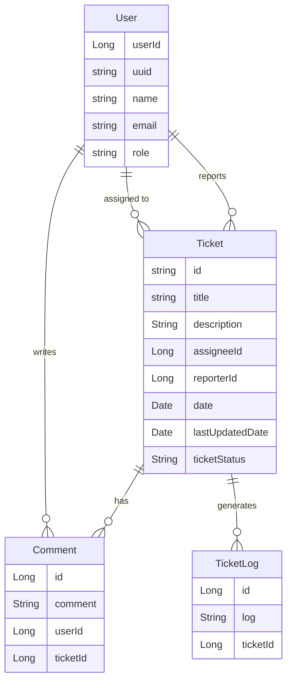

# Project Design: Architecture & Database Schema

This repository contains the high-level architecture and database design for the ticketing system, utilizing **React**, **Keycloak**, **Java Spring Boot**, and **MongoDB**.

## 1. System Architecture Diagram

This diagram illustrates the authentication flow and how the frontend interacts with the backend and security layers.

## 2. Database Schema (ER Diagram)

The following schema defines the relationships for the ticketing system.

