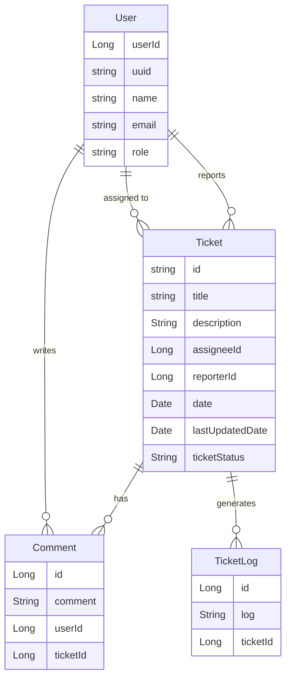

# Project Design: Architecture & Database Schema

This repository contains the high-level architecture and database design for the ticketing system, utilizing **React**, **Keycloak**, **Java Spring Boot**, and **MongoDB**.

## 1. System Architecture Diagram

This diagram illustrates the authentication flow and how the frontend interacts with the backend and security layers.

## 2. Database Schema (ER Diagram)

The following schema defines the relationships for the ticketing system.

## 📌 Services Overview

This project simulates a real-world IT support system where users can create and manage tickets, assign them to support agents, and track their status.

The system is designed with clean architecture principles and focuses on scalability, maintainability, and real-world backend practices.

## ⚙️ Tech Stack

- Java 21
- Spring Boot
- Spring Data MongoDB
- REST APIs
- MapStruct (DTO mapping)
- Mockito & JUnit (Unit Testing)
- Docker (for containerization)

## 🧩 Architecture

The project follows a microservices approach:

- **Ticket Service** → Handles ticket creation, updates, filtering, pagination
- **User Service** → Manages user data and provides user information
- Services communicate via REST APIs

## ✨ Features

- Create and manage tickets
- Filter tickets by status and user
- Pagination support
- Integration between services using API calls
- Mapping between entities and DTOs using MapStruct
- Unit testing using Mockito
- Clean layered architecture (Controller → Service → Repository)

## 🔍 Example Flow

1. Fetch tickets from the database
2. Extract user IDs from tickets
3. Call User Service to get usernames
4. Map data into response DTOs
5. Return enriched ticket data

## 🧪 Testing

- Unit tests for service layer using Mockito
- Mocking external API calls
- Handling dynamic data like `LocalDateTime`

## 📦 Future Improvements

- Authentication & Authorization (Spring Security / Keycloak)
- Event-driven communication (Kafka)
- API Gateway
- Full Docker Compose setup
